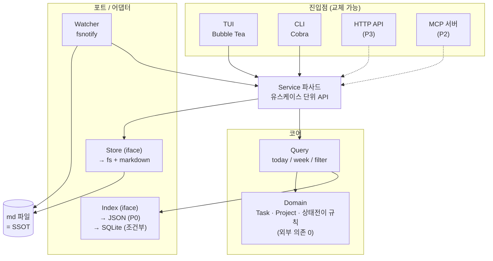

# task-planner 기획서

```
독자        본인 (3개월 뒤 재개 시점의 자신 포함)
목적        개인 업무를 md 파일 SSOT로 관리하는 터미널 네이티브 도구의 범위·구조 확정
대상 환경   로컬 macOS (darwin/arm64), 단일 사용자
최종 검토   2026-09-12
다음 검토   7일 시범 사용 종료 시점 또는 2026-11-12 중 빠른 쪽
상태        확정 — P0·P1 구현 완료, P2 일부 선반영
```

## 구현 상태 (2026-09-12)

구현은 Go + Bubble Tea 로 진행했고 저장소 루트에서 `make build` 로 `./tp` 가 나온다.
계층 규칙과 함정은 `CLAUDE.md`, 사용법은 `README.md` 에 있다.

| 단계 | 상태 | 비고 |
|---|---|---|
| P0 | 완료 | Today/Week/Projects/All, 상태 전이, 빠른 캡처, CLI, JSON 인덱스 |
| P1 (1~6번) | 완료 | 편집기 연동·롤오버·주간 리포트·git 자동 커밋·watcher·질의 DSL |
| P2 (7~11번) | 완료 | 의존성 자동 해제·시간 추적·반복·칸반 보드·WIP 경고 |
| P2 (12번 아카이브) | 완료 | `tp archive` — 기본 30일, 분기별 샤딩, dry-run |
| P2 (13번 MCP) | 완료 | stdio 서버 (`tp mcp`), 읽기 10종 + 쓰기 9종, 삭제 미제공, 작성 규약 검사 |
| P2 (14~16번) | 미착수 | Jira 연동, 컨텍스트 태그, 스탠드업 |
| P3 (20번 FTS) | 부분 | `body:` 질의로 본문 검색. 인덱스가 아니라 파일을 읽는다 (SQLite 전환 없이) |
| P3 (17~19번) | 미착수 | 캘린더 export, 알림, HTTP API |

기획서에 없던 것 중 쓰면서 필요해진 것들도 들어갔다. **진행 기간**
(`scheduled`~`due` 를 한 덩어리로 읽고 Week 그리드에 걸쳐 그림), **하루 용량**
(`daily_capacity` 대비 배정 시간), **되돌리기**(파일 pre-image 기반, 한 동작 =
한 단계), **다중 선택 일괄 처리**, **저장된 뷰**, **다음 할 일 추천**, 프로젝트
생성·마일스톤, 한 줄 메모. 자세한 조작은 `README.md`.

**agent 가 쓴 태스크의 문장.** MCP 로 캡처하면 제목이 길어지고 메모가 문서가
된다 — 모델은 맥락을 빠짐없이 적는 쪽이 안전하다고 보기 때문이다. 그런데 이
vault 를 읽는 사람은 하나뿐이고, 읽기 싫은 목록은 결국 안 읽는 목록이 된다.
그래서 쓰기 도구에 규약 검사를 뒀다. 구조(헤딩·체크박스·단계 계획)는 거부하고
어투는 경고만 한다 — 어투를 거부하면 모델이 고쳐 쓰다 수렴하지 못하고, 캡처가
막히면 도구 자체를 안 쓰게 된다. 규약 전문은 `internal/style/conventions.md`
이고 MCP 리소스 `tp://conventions` 로도 읽힌다.

**남은 검증 하나.** 7일간 실제 업무를 이 도구만으로 관리해 누락 0건을 확인하는
P0 합격 기준은 아직 통과하지 않았다. 기능이 아니라 이 시범 사용이 다음 관문이다.

## 결론 3줄

- **md 파일 1개 = 태스크 1개를 SSOT**로 두고, JSON 인덱스는 언제든 버리고 재생성 가능한 파생물로 분리한다.
- **DB는 지금 넣지 않는다.** Docker Postgres는 이 단계에서 순손실이고, SQLite도 P2 이후 조건부다 — 판단 근거와 전환 트리거는 "DB 판단" 절에 있다.
- **Appetite 2주**로 P0를 끊고, 그 안에 안 들어가는 건 전부 P1 이후로 민다.

## 한 줄 정의

터미널에서 오늘·이번 주 할 일과 그 상태를 보고 바꾸되, 데이터는 사람과 AI가 직접 읽고 쓸 수 있는 markdown 파일로 남는 개인 업무 관리 TUI.

## Problem — 해결하려는 문제

추상적 "생산성"이 아니라 실제로 답하고 싶은 질문들이다. 이 목록이 이후 기능 우선순위의 판단 기준이 된다.

| 답하고 싶은 질문 | 지금 무엇이 불편한가 |
|---|---|
| 오늘 뭘 해야 하지? | 할 일이 Jira, 슬랙 스크롤, 메모 앱, 머릿속에 흩어져 있다 |
| 이번 주에 끝내야 하는 건 뭐가 남았지? | 마감(due)과 실제 착수 예정일(scheduled)이 구분 안 돼 목록이 전부 "급함"으로 보인다 |
| 저건 왜 아직도 보류지? | 보류 사유와 해제 조건이 기록되지 않아 보류 항목이 좀비로 남는다 |
| 이 프로젝트에서 내가 진행 중인 게 뭐지? | 태스크와 프로젝트 문서가 다른 도구에 있어 연결이 끊긴다 |
| 지난주에 내가 뭘 했지? | 주간보고를 쓸 때마다 기억과 커밋 로그를 역추적한다 |

동반 문제: 기존 도구 대부분이 자체 포맷을 쓰기 때문에, Claude Code 같은 에이전트가 내 업무 상태를 읽거나 갱신할 수 없다.

## Appetite

**P0 = 2주.** 고정 기간 + 유동 범위로 운영한다. 2주에 안 들어가면 기능을 줄이지 기간을 늘리지 않는다.

## 사용자와 사용 맥락

혼자 쓴다. 여는 순간은 셋이다.

1. **아침 (2분)** — 터미널 열고 `tp`. 오늘 할 일 확인, 순서 정함.
2. **작업 중 (5초)** — 뭔가 떠오르면 잊기 전에 캡처. 상태를 진행중→완료로 넘김. **여기서 3초 넘게 걸리면 도구를 안 쓰게 된다.**
3. **금요일 (10분)** — 이번 주 완료분 훑고 주간보고 초안 뽑음. 못 끝낸 것 다음 주로 이월.

맥락이 결정하는 것: 항상 터미널에 떠 있어야 하므로 **콜드스타트가 빨라야 하고(목표 100ms 이내), 외부 데몬에 의존하면 안 된다.**

## 목표 / 비목표

**목표**
- md가 유일한 원천. 도구가 사라져도 데이터는 에디터로 읽힌다.
- 상태(대기중/진행중/보류/완료)와 프로젝트 연관이 한 화면에서 보인다.
- TUI 없이 CLI만으로도 캡처·완료 처리가 된다.
- 향후 API/MCP를 붙일 때 도메인·저장 계층을 재작성하지 않는다.

**비목표 (이번에 명시적으로 안 함)**
- 다중 사용자, 권한, 인증
- 실시간 동기화와 충돌 병합 — git으로 충분하다
- 웹 UI, 모바일 앱
- Jira 대체 — 팀 워크플로우는 Jira에 남고 이 도구는 그 위의 개인 레이어다
- 자연어 일정 파싱 고도화 ("다음 주 화요일 오후") — P2에서 재검토
- 서버 상주 프로세스

## 기존 대안과 차별점

| 도구 | 왜 안 맞는가 |
|---|---|
| Taskwarrior | 기능은 충분하나 자체 바이너리 포맷 + 자체 DB라 md로 관리 불가, 메모·문서가 분리됨 |
| todo.txt | 한 줄 포맷이라 긴 작업 메모·결정 기록을 담을 수 없음 |
| Obsidian Tasks | md 기반은 맞으나 GUI 앱 상주 필요, 터미널 워크플로우와 분리 |
| org-mode | 요구를 거의 다 만족하지만 Emacs 종속 |
| dooit 등 TUI 칸반 | 자체 포맷, 프로젝트 연관·리포트 약함 |
| Jira | 팀 단위 도구. 개인 일과 관리엔 무겁고 오프라인 불가 |

**차별점 두 가지.** (1) md SSOT라서 에디터·git·AI 에이전트가 전부 1급 클라이언트가 된다. (2) 향후 MCP 서버 모드로 Claude Code가 직접 업무 상태를 읽고 쓴다 — 위 어느 도구도 제공하지 않는다.

## 핵심 기능 (P0)

각 항목은 위 Problem 표의 질문에 대응한다. 대응이 없으면 뺐다.

| 기능 | 대응 질문 | 내용 |
|---|---|---|
| Today 뷰 | 오늘 뭘 해야 하지 | `scheduled <= 오늘` 또는 진행중인 것. 상태별·프로젝트별 그룹 전환 |
| Week 뷰 | 이번 주 뭐 남았지 | 요일 컬럼 + 마감 임박 + 미배정 백로그 |
| Timeline 뷰 | 이 일이 언제부터 언제까지지 | 태스크당 한 줄의 간트 막대. Week 와 같은 데이터의 다른 질문 |
| 상태 전이 | 저건 왜 보류지 | 대기중/진행중/보류/완료/취소. **보류는 사유·해제조건 없이 저장 불가** |
| 빠른 캡처 | 잊기 전에 적기 | `a` 한 키 또는 `tp add "..."`, 필드는 나중에 채움 |
| 프로젝트 연관 | 이 프로젝트 진행분 | 태스크의 `project` 필드로 참조, 프로젝트 뷰에서 역참조 |
| 인덱스 자동 동기화 | — | md 변경 감지 후 변경분만 재파싱, 인덱스 손상 시 전체 재생성 |
| CLI 서브커맨드 | — | `tp today`, `tp add`, `tp done` — 스크립트·쉘 함수에서 호출 |

"취소"를 완료와 별도로 둔 이유: 둘을 합치면 완료 통계가 왜곡돼 회고가 쓸모없어진다.

All 목록은 완료 항목을 완료일 최신순으로 최대 30개만 표시한다. 검색 필터를
적용할 때는 전체 태스크에서 먼저 찾은 뒤 완료 항목 30개 제한을 적용해 오래된
완료 항목도 검색할 수 있다. Today·All의 목록 묶음은 상태별 → 프로젝트별 →
프로젝트 안에서 상태별 순서로 전환한다. 이 제한은 TUI 표시 범위에만 적용하며
태스크 원본이나 CLI 조회·리포트에는 영향을 주지 않는다.

## 추가하면 좋을 기능

P0에는 없지만 값이 확인된 것들이다. 우선순위는 "P0 못 쓰게 만드는 불편을 없애는 것"이 위다.

| # | 기능 | 왜 필요한가 | 단계 |
|---|---|---|---|
| 1 | 외부 편집기 연동 (`e` → `$EDITOR`) | 긴 메모는 TUI 입력창보다 vim이 낫다. 저장 시 watcher가 자동 반영 | P1 |
| 2 | 데일리 롤오버 + 이월 카운터 | 어제 못 끝낸 것 자동 이월. **3회 이상 이월되면 경고** — 잘못 쪼갠 태스크 신호 | P1 |
| 3 | 주간 리포트 생성 (`tp report week`) | 금요일 10분 맥락. 완료분·이월분·보류분을 md로 뽑아 주간보고 초안 | P1 |
| 4 | git 자동 커밋 | vault를 git repo로. 이력·백업·기기 간 동기화가 공짜로 해결됨 | P1 |
| 5 | 파일 watcher (fsnotify) | 에디터·다른 터미널에서 md를 고쳐도 TUI가 즉시 반영. md SSOT의 전제 조건 | P1 |
| 6 | 검색·필터 DSL | `status:doing project:infra due<7d` 형태. 뷰가 늘어나는 걸 쿼리로 대체 | P1 |
| 7 | 의존성 (`blocked_by`) | 보류 사유가 다른 태스크인 경우. 선행 완료 시 자동 해제 알림 | P2 |
| 8 | 시간 추적 | 진행중 전환 시 타이머, 완료 시 실소요 기록. estimate 대비 누적으로 추정 감각 교정 | P2 |
| 9 | 반복 태스크 (`recur`) | 주간보고·정기 점검 같은 고정 업무를 매번 다시 안 적게 | P2 |
| 10 | 칸반 보드 뷰 | 상태별 컬럼. 진행중이 몇 개인지 한눈에 보임 | P2 |
| 11 | WIP 제한 경고 | 진행중이 N개를 넘으면 경고. 개인 도구에서 효과가 큰 값싼 장치 | P2 |
| 12 | 아카이브 | 완료 6개월 경과분을 `archive/`로 이동, 인덱스에서 분리해 콜드스타트 유지 | P2 ✅ (기본 30일) |
| 13 | **MCP 서버 모드** | Claude Code가 내 업무 상태를 직접 읽고 갱신. 이 도구의 최대 차별점 | P2 |
| 14 | Jira 링크 연동 | `links: [jira:ABC-123]`. Jira 상태 pull, 완료 시 push. Atlassian MCP가 이미 붙어 있음 | P2 |
| 15 | 컨텍스트 태그 (`@deep` `@shallow`) | "30분 비었을 때 할 수 있는 것"을 필터링. 자투리 시간 활용 | P2 |
| 16 | 스탠드업 요약 (`tp standup`) | 어제 한 것 / 오늘 할 것 / 블로커를 한 번에 출력 | P2 |
| 17 | 캘린더 export (ics) | `scheduled` 태스크를 캘린더에 표시 | P3 |
| 18 | 알림 (macOS notification) | 마감 임박, 장시간 진행중 상태 방치 감지 | P3 |
| 19 | HTTP API + 읽기 전용 웹뷰 | 터미널 밖에서 확인. 서버 확장의 첫 단계 | P3 |
| 20 | 전문 검색 (FTS) | 태스크 본문 메모가 쌓인 뒤에 의미가 생김. SQLite FTS5 전환과 세트 | P3 ⚠ `body:` 로 부분 구현 — 싼 조건으로 좁힌 뒤 파일을 읽는다. 이 규모에서는 FTS 엔진이 필요 없었다 |

## 데이터 모델

### 태스크 = md 파일 1개

```markdown
---
id: T-20260912-0001          # 불변. 파일명이 바뀌어도 참조 유지
title: 로그 파이프라인 PoC 결과 정리
status: doing                # todo | doing | blocked | done | cancelled
project: log-pipeline
priority: P1                 # P0~P3
created: 2026-09-12
updated: 2026-09-12
scheduled: 2026-09-12        # 언제 할 것인가  → Today 뷰의 근거
due: 2026-09-15              # 언제까지인가    → 마감 경고의 근거
estimate: 2h
tags: [ops, report]
links: [jira:ABC-123]
---

## Note
PoC 결과 표 3개 + 비용 비교. 결론은 A안.

## Log
- 2026-09-12 09:14 todo → doing
```

ID의 날짜는 생성일이고 뒤 번호는 vault 전체에서 이어진다. 아카이브된 작업도 이미
쓴 번호로 센다. 과거 날짜별 채번으로 생긴 중복은 파일이나 ID를 바꾸지 않고
`#20260925-15`처럼 날짜를 붙여 표시·지정한다. 중복된 `#15`만 입력하면 어느
작업인지 선택하지 않고 오류로 알린다.

**설계 판단 세 가지.**

`scheduled`와 `due`를 나눈 것이 이 모델의 핵심이다. 합치면 Today 뷰가 "마감이 오늘인 것"만 보여주거나 전부 보여줘서 어느 쪽이든 쓸모가 없어진다.

`blocked` 상태는 `blocked_reason` 또는 `blocked_by` 중 하나가 없으면 저장을 거부한다. 개인 업무 관리에서 가장 흔한 실패가 보류 항목이 사유 없이 영구 적체되는 것이다.

상태 전이 이력은 본문 `## Log` 섹션에 남긴다. frontmatter 배열로 넣으면 diff가 지저분해지고, 별도 이벤트 파일로 빼면 md가 더 이상 SSOT가 아니게 된다.

### 프로젝트 = 디렉토리가 아니라 필드 참조

`projects/<slug>/project.md`에 프로젝트 메타를 두고, 태스크는 `project:` 필드로 참조한다. 태스크 파일을 프로젝트 디렉토리 아래 두지 않은 이유는 프로젝트 이동 시 파일 이동이 필요해지고, 다중 프로젝트 연관이 불가능해지기 때문이다. 탐색은 인덱스가 만든 뷰로 한다.

### 인덱스 = 파생물

`.index/index.json`에 전체 태스크의 frontmatter 요약과 각 파일의 mtime·hash를 담는다. 기동 시 mtime을 비교해 변경분만 재파싱한다. **인덱스는 언제 지워도 md에서 완전 재생성된다** — 이 불변식을 깨는 필드를 인덱스에만 두면 안 된다.

## 아키텍처



이 그림에서 볼 것: 네 개의 진입점이 모두 Service 파사드 하나만 호출하고, UI 계층은 파일을 직접 건드리지 않는다.

**불변 규칙 세 가지.** UI는 Store를 직접 호출하지 않는다 — 이게 깨지면 MCP/API 확장 시 로직을 두 번 구현하게 된다. Domain은 외부 패키지를 import하지 않는다. Index는 인터페이스 뒤에 두어 JSON→SQLite 교체가 파일 1개 교체가 되게 한다.

**쓰기 안전.** 단일 사용자지만 TUI·CLI·에디터가 동시에 붙는다. md 쓰기는 temp 파일 생성 후 rename으로 atomic 처리하고, 인덱스 갱신은 `.index/lock` flock으로 직렬화한다.

## DB 판단 — 지금은 넣지 않는다

질문에 대한 답이다.

**Docker Postgres: 이 단계에서는 순손실.** 이유는 성능이 아니라 기동 조건이다. 아침에 터미널 열고 2초 안에 오늘 할 일을 봐야 하는 도구가 Docker 데몬 기동 여부에 의존하면, 도커가 안 떠 있는 날 도구를 안 쓰게 된다. 한 번 안 쓰면 데이터가 낡고 낡으면 영영 안 쓴다. 개인 도구의 실패는 성능이 아니라 이 경로로 온다.

**SQLite도 P0에는 불필요.** 태스크 2,000건 기준 frontmatter 요약 JSON은 1~2MB 수준이고(추정, md 평균 1KB·요약 500B 가정) 전체 로드·파싱이 수십 ms다. 콜드스타트 100ms 목표 안에 들어간다.

**전환 트리거 — 아래 중 하나라도 걸리면 재검토한다.**

| 신호 | 전환 대상 |
|---|---|
| 인덱스 태스크 10,000건 초과, 또는 콜드스타트 300ms 초과 (실측 기준) | SQLite |
| 태스크 본문 전문 검색이 필요해짐 | SQLite + FTS5 |
| 집계 리포트 쿼리가 Go 코드로 감당 안 됨 | SQLite |
| 여러 기기에서 동시 쓰기, 또는 원격 서버 상주 | Postgres + 서버 아키텍처 재설계 |

SQLite로 가더라도 `modernc.org/sqlite`(cgo 불필요)를 쓰면 단일 바이너리 배포가 유지된다. **어느 경우에도 SQLite는 인덱스/캐시이고 md가 SSOT라는 관계는 유지한다.** 이 관계가 뒤집히면 md 관리라는 전제 자체가 무너진다.

## 파일 레이아웃

### 코드 저장소

```
task-planner/
├── cmd/tp/main.go
├── internal/
│   ├── domain/          task.go  project.go  status.go  transition.go
│   ├── store/           repo.go(iface)  fsrepo.go  markdown.go  frontmatter.go  atomic.go
│   ├── index/           index.go(iface)  jsonindex.go        # 후일 sqliteindex.go
│   ├── query/           views.go  filter.go  dsl.go
│   ├── service/         service.go                           # 파사드
│   ├── watch/           watcher.go
│   ├── config/          config.go  defaults.go
│   ├── tui/             app.go  keymap.go  theme.go
│   │   └── views/       today.go  week.go  project.go  detail.go  capture.go
│   └── cli/             root.go  add.go  today.go  done.go  report.go
├── docs/                product-task-planner-202609.md  adr/
├── testdata/vault/                                          # 골든 파일 테스트용
├── Makefile
├── go.mod
└── CLAUDE.md                                                # 작업 규약 (기획서와 분리)
```

### 데이터 vault (경로는 config로 지정, 기본 `~/tasks`)

```
~/tasks/
├── config.yaml                      # 경로·키맵·상태 워크플로우·WIP 한도
├── inbox.md                         # 분류 전 자유 캡처
├── tasks/
│   └── 2026-09/
│       ├── T-20260912-0001-log-pipeline-poc.md
│       └── T-20260912-0002-weekly-report.md
├── projects/
│   └── log-pipeline/project.md
├── archive/2026-Q1/                 # 완료 후 아카이브
├── reports/2026-W37.md              # tp report 산출물
└── .index/                          # 파생물 — .gitignore 대상
    ├── index.json
    ├── meta.json                    # schema 버전, 빌드 시각
    └── lock
```

월 단위 샤딩(`tasks/2026-09/`)은 디렉토리당 파일 수를 수백 건으로 묶어 전체 스캔과 아카이브 이동을 단순하게 만들기 위한 것이다.

## 화면 구조 (P0)

```
┌ task-planner ─────────────────────────── 2026-09-12 (금) W37 ┐
│ [1]Today [2]Week [3]Board [4]Timeline [5]Projects [6]All     │
├──────────────────────────────────────────────────────────────┤
│ ▾ 진행중 (2)                                      WIP 2/3    │
│   ● T-0412  로그 파이프라인 PoC 결과 정리  log-pipeline  2h  │
│   ● T-0407  배포 스크립트 권한 이슈        infra             │
│ ▾ 대기중 (4)                                                 │
│   ○ T-0421  주간보고 초안                  -            ~30m │
│ ▾ 보류 (1)                                                   │
│   ⊘ T-0390  DB 마이그레이션   ← 인프라팀 회신 대기 (3일 경과)│
│ ▾ 오늘 완료 (3)                                     ⌄ 접힘   │
├──────────────────────────────────────────────────────────────┤
│ a 추가  e 편집  space 상태  b 보류  d 완료  p 프로젝트  ? 도움│
└──────────────────────────────────────────────────────────────┘
```

핵심 인터랙션: `a` → 한 줄 입력 → 즉시 목록 반영(파일 생성은 비동기). `space` → 상태 순환. `b` → 사유 입력 없이는 닫히지 않는 보류 모달. `enter` → 상세 패널, `e` → `$EDITOR`.

Today·All 작업 목록은 `f`로 상태별·프로젝트별 묶음을 전환한다. 프로젝트별 묶음은
프로젝트명 순으로 보여주고 미지정 작업은 마지막에 둔다. 필터 결과만 묶으며
각 작업의 상태 표시와 기존 정렬은 유지한다. 묶음 방식은 `.index/ui.json`에 저장한다.

## 마일스톤

| 단계 | 범위 | 완료 조건 |
|---|---|---|
| **P0** (2주) | vault 읽기·쓰기, JSON 인덱스, Today/Week/All 뷰, 상태 전이, 빠른 캡처, `tp add/today/done` | **실제 내 업무를 7일간 이 도구만으로 관리했을 때 누락 0건.** 이게 유일한 합격 기준이다 |
| **P1** (+3주) | 표의 1~6번 (편집기 연동, 롤오버, 주간 리포트, git 자동 커밋, watcher, 필터 DSL) | 주간보고를 `tp report week` 출력에서 시작해 작성 완료 |
| **P2** | 7~16번 (의존성, 시간 추적, 반복, 보드, MCP, Jira 연동) | MCP 모드에서 Claude Code가 태스크를 조회·갱신 |
| **P3** | 17~20번 (캘린더, 알림, HTTP API, FTS) | 조건부 — 실제 수요가 확인되면 |

## Rabbit holes — 미리 차단할 시간 낭비 지점

- **md 파서 직접 구현 금지.** frontmatter는 `goccy/go-yaml`, 본문은 필요해지면 `goldmark`. 자체 파서를 쓰기 시작하면 2주가 여기서 끝난다.
- **TUI 레이아웃 엔진 자작 금지.** Lipgloss가 제공하는 범위 안에서 화면을 설계한다.
- **P0에서 인덱스 증분 갱신 최적화 금지.** 2,000건 전체 재스캔이 100ms 안에 끝난다. 느려지면 그때 한다.
- **상태 워크플로우 커스터마이징 금지.** 5개 상태를 하드코딩한다. config로 뺄 수 있게 만들면 뷰·전이·통계가 전부 일반화돼야 한다.
- **동기화 직접 구현 금지.** git 커밋·푸시를 호출할 뿐 병합 로직을 만들지 않는다.

## 가정

작성자가 세운 전제다. 검증되면 갱신한다.

- 태스크 생성량 하루 5~15건, 연 2,000건 내외 **(추정, 실측 근거 없음)**
- md 파일 평균 1KB, frontmatter 요약 500B **(추정)**
- 동시 접근은 TUI 1 + CLI 간헐 + 에디터 1. 다중 세션 동시 쓰기는 없음
- vault는 git repo이며 백업은 원격 저장소에 의존
- 로컬 환경: go 1.25.11 darwin/arm64, Docker 29.4.0 (2026-09-12 확인)

## 재검토 트리거

- P0가 2주 안에 안 끝나면 → 범위를 Today 뷰 + 캡처 + 상태 전이로 더 줄인다
- 콜드스타트 300ms 초과 또는 태스크 10,000건 초과 → 인덱스 백엔드 재검토 (위 DB 절)
- 다중 기기 실시간 동기화 요구 발생 → 서버 아키텍처로 문서 신규 작성
- 7일 시범 사용에서 도구를 안 열게 되면 → 기능이 아니라 마찰 지점을 찾는다. 기능 추가로 대응하지 않는다

## 열린 질문

1. ~~vault 경로~~ — `~/tasks` 로 결정(2026-09-12). `TP_VAULT` / `--vault` 로 재지정
   가능. journal 은 "왜·경과", task-planner 는 "지금 할 일"로 경계를 둔다.
2. Jira 연동을 P2에 둘지 P1로 올릴지 — 실제 Jira 사용 빈도에 달림
3. `inbox.md` 자유 캡처를 유지할지 — 현재는 디렉토리만 만들고 쓰지 않는다. 모든
   캡처가 바로 태스크 파일이 되므로, 시범 사용에서 필요성이 확인되면 붙인다.
4. ~~반복 태스크의 실체~~ — 회차마다 새 파일로 결정(2026-09-12). 회차별 메모와
   주간 리포트 정확도를 위해서다. `recur_of` 가 시리즈를 묶는다.
